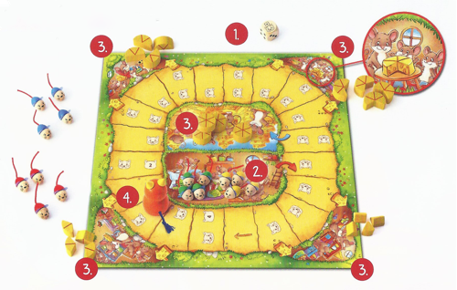
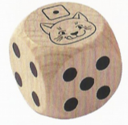
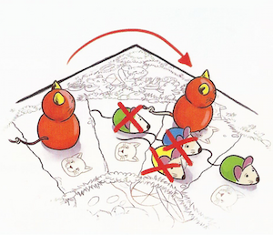
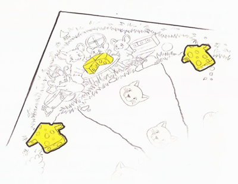

Viva Topo! ねことネズミの大レース
====================================

## 付属品

- ゲームボード1枚
- ネコ 1匹
- チーズ 20個 (1,2,3,4ピースが4つずつ。ホールチーズ4つ）
- サイコロ1個

## ゲームの準備

1. ゲームボードとサイコロをテーブルの中央に置く
2. 全員が自分の選んだ色のネズミを選び、ゲームボード中央のネズミの家に置く。2人で遊ぶときは各自ネズミ5匹ずつ。3〜4人で遊ぶときは各自ネズミ4匹ずつを使う。
3. 1ピース、2ピース、3ピース、4ピースの4つのチーズを角にある「ネズミ友達の家」に配置する。それぞれの絵にあるチーズのサイズに合わせる。ホールチーズを中央の「チーズの国」に配置する。
4. ネコをネコマークの位置に配置する。2人で遊ぶときは2番のネコマークの位置に。3人で遊ぶときは3番。4人で遊ぶときは4番のネコマークになる。

## 遊び方

このゲームの目的は、

「**美味しいチーズを出来る限りたくさん集めること**」 です。

一番チーズが好きな人からサイコロを振ります。その人から時計回りにゲームを進めます。

### サイコロを振って数字の目が出た

あなたのネズミ1匹を家から出してスタートさせます。
ネズミを赤の矢印にしたがって、サイコロの目の数だけ動かします。1回に動かせるネズミは1匹だけです。

**ヒント:**  
できるだけ多くのネズミを家から出してレースに参加させましょう。ネコがボードを回ってネズミの家の前までやってくると、家に残っていたネズミは全て食べられてゲーム外に退場になってしまいます。

同じマスに1度に5匹以上のネズミは置けません。もしすでに4匹のネズミがいるマスに、あなたのネズミがとまりそうになった時は、1つ前のマスに置きます。（進めなかった分を、あとにくりこして使うことはできません）

### サイコロを振ってネコの目が出た

まず先にネズミを1マス進めます。そのあとネコも1マス進めます。そして次のプレイヤーの番になります。

ネズミはチーズの国に到着するまでボードを1周だけ回ります。ネコはネズミよりもずっと前方からスタートしますが、ボードを2周回ります。サイコロでネコの目が出たとき、ネコは1周目は1マスずつ進みますが、2周目は（矢印のマークにそって）2マスずつ進みます。

### 助けて！ネコが近づいてきた！

ネコがあなたのネズミに近づいてきたら、早くそのネズミを前方へ進めて逃がして下さい。

お腹をすかせたネコが、ネズミを追い越したり、または同じマスに止まったりしたら、それらのネズミはすべてネコに食べられてゲーム外に退場になります。

**ヒント:**  
ゲームが始まったばかりのときは、ネズミはネコの後ろにいます。だからすぐに追いつかれることはありません。

### ネズミを友達の家に逃がす

ネコに捕まえる前にネズミを安全な場所に逃がすことができます。

ネズミの友達の家に避難させることです。友達の家はボードの4隅にありす。2つの矢印（チーズ形）のマスから入ることができます。

友達の家も1マスと数えます。つまりあなたは友達の家に到着するのと同じか、それ以上のサイコロの目を出さなければ家に入れません。（ちょうどでなくても構いません）

ネズミが安全な友達の家に入ったら、そのネズミのレースはおしまいです。友達の家に置いてあるチーズ片を受け取ってくつろいで下さい。

チーズの国に近い友達の家ほど、大きなチーズ片が置いてあります。もし置いてあるチーズを、先に到着したネズミたちに全部取られてしまったら、残念ながら、あとから来たネズミはチーズをもらえません。

どこの友達の家にネズミが何匹入っても構いません。ネズミは時計回りの方向からしか家に入れず、一度友達の家を通りすぎてしまったら戻って入り直すことはできません。

### 自分のネズミが全部いなくなった

もしあなたのネズミが、チーズの国や友達の家に到着したり、残念ながらネコに食べられてしまったりして、すべていなくなっても自分の番にはサイコロを振ります。ボード上の全部のネズミがいなくなるまでです。

サイコロの目がネコの時はネコを動かします。通常の数字の時には何もしません。

### チーズの国

ネズミがチーズの国に到着するとホールチーズがもらえます！ただし先についたネズミたちに全部取られてなくなっているかもしれません。

## ゲーム終了

すべてのネズミがチーズの国に到着したり、友達の家に入ったらゲームは終了です。自分のチーズの数を数えて下さい。

チーズを一番たくさん持っている人がゲームの勝者です。小さく分けたチーズを数えて下さい。

1ホールのチーズは6ピース分のサイズです。友達の家でもらったチーズはそれぞれ1,2,3,4ピースのサイズになります。

